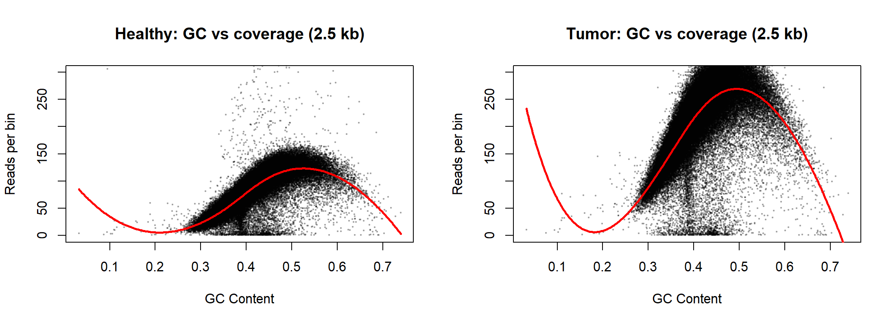
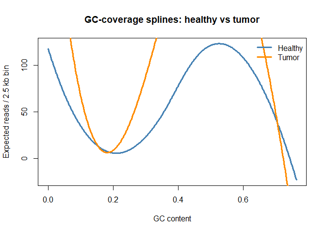

```{r setup, include=FALSE}
knitr::opts_chunk$set(echo = FALSE, message = FALSE, warning = FALSE,
                      fig.align = "center", dev = "png", dpi = 200,
                      cache = TRUE)
```

```{r paths_and_data, include=FALSE}
if (!require('data.table')) { install.packages('data.table'); library('data.table') }
if (!require('splines'))    { install.packages('splines');    library('splines') }

source("../utils.R")
source("../lab5/lab5_utils.R")

healthy_file <- "../lab2/data/TCGA-13-0723-10B_lib2_all_chr1.forward"
tumor_file   <- "../lab7/data/TCGA-13-0723-01A_lib2_all_chr1.forward"
chr1_file    <- "../lab1/data/chr1_str.rda"

# Converged choices (see presentation_content_map.md)
BIN <- 2500
```

```{r load_data, include=FALSE}
healthy_reads <- fread(healthy_file, col.names = c("Chr", "Loc", "Length"))
tumor_reads   <- fread(tumor_file,   col.names = c("Chr", "Loc", "Length"))
load(chr1_file)

# Bin data using the BIN size defined earlier
df_h <- bin_data(healthy_reads, chr1, 1, nchar(chr1), BIN)
df_t <- bin_data(tumor_reads,   chr1, 1, nchar(chr1), BIN)
```

<!-- =====================================================================
  PRESENTATION SCAFFOLD — one slide per "##", ~1-2 per stage.
  Content intentionally left as TODO placeholders; fill after deciding:
    (1) single-sample (b) vs two-sample (d) headline method
    (2) which figures to regenerate (see Gaps in presentation_content_map.md)
  Audit landmines (see AUDIT_findings.md):
    - do NOT quote Lab 6 16/84 variance split (double-counted)
    - present t-stat ranking WITH the pmin(y,5) capping caveat
===================================================================== -->

# Background

## The consultant's request

TODO — the request, the data received (`-10B` healthy / `-01A` tumor `.forward`),
external data (reference chr1 for GC).

## The uncorrected region (~28.5 Mb)

TODO — single-panel method-(a) plot, 25–30 Mb. "The event is buried in noise."

```{r bg_uncorrected_plot, eval=FALSE}
# REGENERATE: single-panel uncorrected CN, 25-30 Mb (extract from lab8 qa-plot)
```

# A — Statistical Model

## From fragment counts to copy number

TODO — model equation $Y_k \sim \text{Pois}(\lambda_k),\ \lambda_k = a_k \cdot f(\text{gc}_k) \cdot \epsilon_k$,
each term annotated; VMR $\approx 14.7$ as the motivation that a single $\lambda$ fails.

# B — Modeling the GC Effect

## GC vs. fragment count + spline fit

```{r gc_spline_plots, out.width="48%", fig.show='hold', eval=TRUE}
# Display the scatter plot with the cubic B-spline fit for both healthy and tumor samples side-by-side
# We reuse the plots already generated in Lab 7 to ensure consistency and save render time

```

## Why fit the spline separately per sample

```{r gc_compare_plots, out.width="48%", fig.show='hold', eval=TRUE}
# Overlay the two spline curves to visually demonstrate the batch effect differences
# This proves why fitting a separate spline per sample is strictly required

```

# C — The Estimator

## Plug-in estimator and the two-sample ratio

**1. Single-Sample (Plug-in) Estimator:**
To remove the GC bias, we divide the observed counts by the spline prediction:
$$ \hat{a}_k = \frac{Y_k}{\hat{f}(\text{gc}_k)} \cdot \hat{M} $$

**2. The Stabilizer ($c=1$):**
To prevent division by zero in sparse regions, we add a constant stabilizer:
$$ \hat{a}_k = \frac{Y_k + 1}{\hat{f}(\text{gc}_k) + 1} \cdot \hat{M} $$

**3. The Two-Sample Ratio (Method d):**
Dividing Tumor by Healthy cancels out shared systemic noise ($\gamma_k$):
$$ \hat{a}_k^{(d)} = \frac{(Y_k^T + 1) / (\hat{f}_T(\text{gc}_k) + 1)}{(Y_k^H + 1) / (\hat{f}_H(\text{gc}_k) + 1)} \cdot \hat{M}_{\text{final}} $$

# D — Success Measure

## Quantifying separation of the event

To objectively measure how well our method separates the true biological deletion from the surrounding noise, we apply a **Welch t-test**.

**1. Test Regions:**
* **Event (Signal):** $28 \text{ Mb} - 29 \text{ Mb}$
* **Background (Noise):** $25 \text{ Mb} - 28 \text{ Mb} \cup 29 \text{ Mb} - 30 \text{ Mb}$

**2. Test Statistic (Separation Score):**
$$ t = \frac{\bar{X}_{\text{event}} - \bar{X}_{\text{background}}}{\sqrt{\frac{S_{\text{event}}^2}{N_{\text{event}}} + \frac{S_{\text{background}}^2}{N_{\text{background}}}}} $$
*(A higher absolute $t$-value indicates a sharper separation between the tumor event and the background).*

**3. Important Caveat (Outlier Capping):**
Before computing the metric, we applied a hard cap of `pmin(y, 5)` to restrict extreme outliers. While this stabilizes the local variance, it acts as a non-linear transformation that slightly biases the absolute ranking of the methods.

# E — Corrected Region & Results

## Corrected vs. uncorrected at 28.5 Mb

TODO — single-region before/after overlay (regenerate from `lab8.Rmd:qa-overlay`, 25-30 Mb only).

```{r corrected_overlay, eval=FALSE}
# REGENERATE: single-region (25-30 Mb) overlay, methods (a) and (d) emphasized
```

## The numbers

TODO — Welch t-stat table (re-run `lab8.Rmd:qb-metric` for exact values);
headline: method (d) best, (b) second. Takeaway + caveat.
